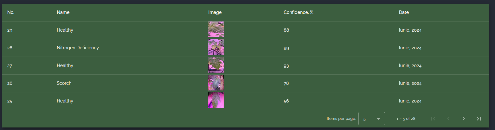

# Tomato Lens
This is the repository for the Tomato Guardians team, a project for the [Earth Rover](https://utm.md/en/blog/2024/03/22/the-earth-rover-spring-edition-hackathon-at-utm/) contest.

- Innovative project revolutionizing tomato cultivation through advanced image processing
- Utilizes Robotino Festo platform in greenhouse, controllable via PC or mobile 
- Empowered by Raspberry Pi 5 for real-time plant analysis
- Provides instant insights on plant health via PC or monitor
- Enhances cultivation experience, facilitating informed decision-making.

## Contributors
- [Grena](https://github.com/Grena30/)
- [Sufferal](https://github.com/Sufferal/)
- [Syn4z](https://github.com/syn4z)

## Dependencies
### Frontend
- [Angular](https://angular.io/)
- [Angular Material](https://material.angular.io/)

### Backend
- [Flask](https://flask.palletsprojects.com/en/3.0.x/)
- [SQLAlchemy](https://www.sqlalchemy.org/)
- [Swagger](https://swagger.io/)

## Installation
- Clone the repository
```
git clone git@github.com:Syn4z/EarthRover.git
```
### Frontend
- Install dependencies
```
npm install
```
- Start the server for the frontend
```
npm start
```
- Open the app in your browser at [http://localhost:4200](http://localhost:4200)
### Backend
- Start the server that gets images from the main server inside `frontend/src` folder
```
python3 server.py
```
- Start the main server 
```
python3 app.py
```
- Start the Raspberry Pi server
```
python3 main.py
```

- Open the API documentation in your browser at [http://localhost:5000/swagger](http://localhost:5000/swagger)

## Application
### Live Feed


### Gallery


### Table


### Swagger 
